# Tender Agent 产品需求文档

## 1. 背景

面向投标群体的标书编制工作通常存在资料分散、图文素材复用效率低、招标文件理解成本高、生成效率低、多人反复修改等问题。企业内部往往已经沉淀了产品说明书、售前售后方案、政策文件、工作文档、历史标书及图片素材，但缺少统一的智能化调用方式。

为提升投标方案编制效率与一致性，需要建设一个 `Tender Agent`，通过企业知识库、图库与招标文件智能解析能力，帮助用户完成从招标文件上传、内容分析、方案生成、修改调整到文档导出的完整流程。

## 2. 目标

- 为投标团队提供一套面向标书编制场景的智能体产品。
- 支持企业沉淀并复用知识资产与图片资产，提升生成内容的相关性与专业度。
- 基于招标文件自动分析招标要求并生成投标方案目录与正文，降低人工整理成本。
- 支持用户在生成前进行参数配置，在生成后进行修改调整，并导出最终标书文档。

## 3. 非目标

- 本期不覆盖投标报名、保证金缴纳、在线投标等交易平台能力。
- 本期不要求自动完成所有商务报价测算与成本核算能力。
- 本期不包含复杂多人协同编辑、版本对比与审批流能力。
- 本期不要求替代专业排版软件的全部高级排版能力。

## 4. 目标用户

- 投标专员：负责上传招标文件、组织资料、生成初版标书并调整内容。
- 售前方案人员：负责沉淀方案模板、产品资料、服务方案并参与内容优化。
- 企业知识管理员：负责维护知识库内容、分类与可复用文档。
- 素材管理员或设计支持人员：负责维护图库中的图片素材。

## 5. 用户场景

- 作为投标专员，我希望上传招标文件后由系统自动解析招标要求，并生成投标方案目录和正文初稿，以缩短编制周期。
- 作为售前人员，我希望系统在生成标书时优先参考公司已有的产品说明书、历史标书和服务方案，以保证内容专业性与一致性。
- 作为知识管理员，我希望将不同类型的企业资料归集到知识库中，供后续项目生成时按需选择。
- 作为投标专员，我希望为不同项目选择不同页数和内容风格，以适配不同招标场景和客户偏好。
- 作为素材管理员，我希望上传图片到图库，并在生成标书时被 AI 识别和引用，以提升文档表现力。

## 6. 产品范围

### 6.1 In Scope

- 企业知识库创建与管理。
- 知识库文档上传与分类管理。
- 企业图库创建与管理。
- 图库图片上传与 AI 识别引用。
- 项目创建与招标文件上传。
- 可选上传澄清文件、工程/货品/服务清单。
- 基于招标文件的智能解析。
- 生成投标方案时配置页数、内容风格、知识库、图库。
- AI 生成解析结果、投标方案目录与目录扩写正文。
- 用户对生成结果进行修改调整。
- 导出最终标书文档。

### 6.2 Out of Scope

- 在线招投标平台对接与自动投标。
- 自动商务报价引擎。
- 多组织、多租户复杂权限体系的完整建设。
- 高级文档协同、审批、审校流。
- 图片精修、复杂设计编排能力。

## 7. 核心业务流程

```mermaid
flowchart TD
    A[创建企业知识库] --> B[上传知识文档]
    A --> C[创建企业图库]
    C --> D[上传图片素材]

    E[创建投标项目] --> F[必传: 招标文件]
    E --> G[可选: 澄清文件]
    E --> H[可选: 工程/货品/服务清单]

    F --> I[系统解析招标文件]
    G --> I
    H --> I

    I --> J[生成解析结果]
    J --> K[配置生成参数]
    K --> L[选择页数]
    K --> M[选择内容风格]
    K --> N[选择知识库 可选]
    K --> O[选择图库 可选]

    L --> P[生成投标方案目录]
    M --> P
    N --> P
    O --> P

    P --> Q[AI 扩写目录内容]
    Q --> R[生成完整标书文档]
    R --> S[用户修改调整]
    S --> T[导出文件]
```

## 8. 功能需求

### 8.1 知识库管理

- 系统必须支持企业创建一个或多个知识库。
- 系统必须支持向知识库上传文档资料。
- 知识库支持的资料类型至少包括：
  - 产品说明书
  - 售前售后方案
  - 政策文件
  - 工作文档
  - 以往标书
- 系统应支持用户在生成投标方案时选择一个或多个知识库作为参考来源。
- 系统应在生成时基于已选知识库内容进行引用、归纳或改写，提升输出内容与企业资料的一致性。

### 8.2 图库管理

- 系统必须支持企业创建图库。
- 系统必须支持上传图片至图库。
- 系统应支持 AI 对图库图片进行识别，以便在标书生成时进行匹配和引用。
- 系统应支持用户在生成投标方案时选择是否关联图库。
- 当用户未选择图库时，系统仍可继续完成文字类标书生成。

### 8.3 项目创建与资料上传

- 系统必须支持创建投标项目。
- 创建项目时必须上传招标文件，否则不可进入后续分析与生成流程。
- 创建项目时可选择上传澄清文件。
- 创建项目时可选择上传工程/货品/服务清单。
- 系统应明确区分必传材料与选传材料，并在界面上给出提示。

### 8.4 招标文件解析

- 系统必须对上传的招标文件进行智能分析。
- 当存在澄清文件或清单文件时，系统应将其作为补充输入参与分析。
- 系统应输出结构化解析结果，至少包括：
  - 项目基础信息
  - 招标要求要点
  - 关键技术或服务要求
  - 重要商务要求
  - 可能影响投标方案编制的重点条款
- 系统应基于解析结果生成初始投标方案目录。

### 8.5 投标方案生成配置

- 用户在生成投标方案前，系统必须支持配置页数。
- 用户在生成投标方案前，系统必须支持选择内容风格。
- 内容风格至少需要支持后续扩展，不应在架构上写死为单一风格。
- 用户在生成投标方案前，可选择关联知识库。
- 用户在生成投标方案前，可选择关联图库。

### 8.6 投标方案生成

- 用户确认生成后，系统必须基于招标文件解析结果、已选知识库与图库生成投标方案。
- 系统必须先生成解析结果和对应目录，再基于目录进行内容扩写。
- 系统应输出可供用户查看和调整的目录结构。
- 系统应依据目录生成完整标书正文内容。
- 系统生成的内容应尽量与招标要求、企业知识资产和用户选择的风格保持一致。

### 8.7 修改调整与导出

- 系统必须支持用户在生成完成后对标书内容进行修改调整。
- 系统必须支持导出最终标书文件。
- 导出文件应保持基本可交付性，便于后续继续编辑或直接使用。

## 9. 非功能需求

- 性能：常规规模的招标文件上传后，系统应在可接受时间内完成解析并给出反馈，避免用户长时间无响应等待。
- 稳定性：在知识库未选择、图库未选择、可选文件未上传的情况下，主流程仍需可正常执行。
- 可扩展性：知识库类型、内容风格、输出模板需支持后续扩展。
- 可追溯性：系统应保留项目生成过程中的关键输入与输出，便于用户回看解析结果和生成内容。
- 安全性：企业上传的知识文档、历史标书、图片素材和招标文件应被安全存储，避免数据泄露。

## 10. 关键页面/模块建议

- 知识库管理页
- 图库管理页
- 项目创建页
- 招标文件解析结果页
- 投标方案生成配置页
- 方案目录与正文编辑页
- 导出页

## 11. 验收标准

- 给定用户进入项目创建流程，当未上传招标文件时，系统不允许提交项目创建。
- 给定用户已上传招标文件，当触发分析后，系统能够生成结构化解析结果。
- 给定用户上传了澄清文件或清单文件，当触发分析后，系统能够将补充文件纳入分析范围。
- 给定用户进入生成配置环节，系统能够让用户选择页数和内容风格。
- 给定用户未选择知识库和图库，当确认生成后，系统仍可生成基础投标方案。
- 给定用户选择了知识库，当确认生成后，生成结果能够参考知识库内容。
- 给定用户选择了图库，当确认生成后，系统能够在生成过程中使用图库素材。
- 给定系统已完成解析，当生成投标方案时，系统先生成目录，再扩写生成正文。
- 给定系统已生成完整标书文档，当用户修改内容后，系统允许导出最终文件。

## 12. 依赖与风险

### 12.1 依赖

- 大模型能力：用于文件解析、目录生成、正文扩写与图片识别理解。
- 文档解析能力：用于解析招标文件、澄清文件及清单类附件。
- 文档导出能力：用于输出最终标书文件。
- 企业资料沉淀质量：知识库质量会直接影响生成结果质量。

### 12.2 风险

- 招标文件格式复杂或扫描质量较差，可能影响解析准确度。
- 企业知识库资料质量参差不齐，可能导致生成内容不一致或引用失真。
- 图库素材缺少结构化标签时，图片匹配效果可能不稳定。
- 用户对“页数”和“内容风格”的预期较主观，可能影响生成满意度。
- 若缺少人工复核环节，自动生成内容可能存在合规、表述或事实性风险。

## 13. 假设

- 本期默认面向单企业内部使用场景，不展开复杂租户隔离需求。
- “内容风格”在本期主要表现为不同写作和呈现风格，而非完整设计模板系统。
- “导出文件”默认至少支持一种主流可编辑文档格式，具体格式待后续明确。
- 用户会在最终提交投标文件前对 AI 生成内容进行人工检查和调整。

## 14. 待确认问题

- 知识库是否需要支持分层分类、标签和权限控制。
- 图库是否需要支持手工标签、按项目引用统计和去重能力。
- 页数控制是强约束、软约束，还是仅作为篇幅偏好。
- 内容风格的初始枚举值有哪些，例如正式型、技术型、营销型、简洁型。
- 导出文件的目标格式是否为 `docx`、`pdf` 或两者都支持。
- 解析结果与目录是否允许用户在扩写前进行人工编辑确认。
- 是否需要记录每次生成的版本历史，以便回溯与比较。

