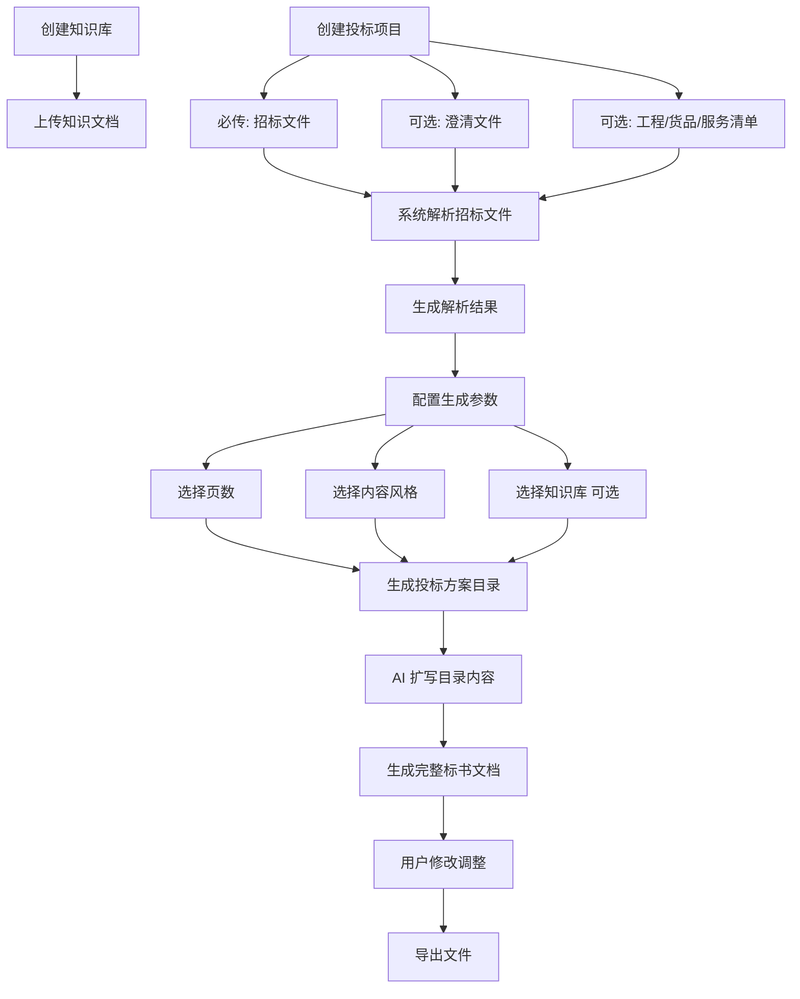

# Tender Agent 产品需求文档

## 1. 背景

面向投标场景的标书编制工作通常存在资料分散、招标文件理解成本高、历史内容难复用、方案生成效率低等问题。当前需要建设一个 `Tender Agent`，帮助用户完成从资料上传、招标文件解析、知识库检索增强、方案生成、内容调整到文档导出的完整流程。

当前阶段聚焦“先把主链路跑通”，不追求大而全能力。

## 2. 目标

- 为投标场景提供一条可运行的智能标书生成闭环。
- 支持沉淀和复用知识库资料，提升生成内容的专业性与一致性。
- 基于招标文件自动分析要求，生成目录与正文初稿，降低人工整理成本。
- 支持用户在生成前配置篇幅与风格，在生成后进行修改与导出。

## 3. 非目标

- 本期不覆盖在线投标、保证金、报名等交易平台能力。
- 本期不覆盖自动报价引擎与复杂成本核算。
- 本期不覆盖复杂多人协同、审批流与版本对比体系。
- 本期暂不启用图库管理、图片识别引用与图片素材编排能力。
- 本期不建设复杂企业组织、部门、角色权限体系。

## 4. 目标用户

当前阶段按“企业即用户”建模，不区分企业主体与个人用户主体：

- 一个用户主体代表一个企业使用单元。
- 该主体负责上传资料、创建项目、触发生成和导出结果。

## 5. 用户场景

- 作为用户，我希望上传招标文件后由系统自动解析招标要求，并生成投标方案目录和正文初稿，以缩短编制周期。
- 作为用户，我希望系统在生成标书时优先参考我沉淀的产品说明书、历史标书和服务方案，以保证内容专业性与一致性。
- 作为用户，我希望在不同项目中选择不同篇幅和内容风格，以适配不同招标场景。
- 作为用户，我希望在 AI 生成完成后继续修改内容，并导出为可交付文档。

## 6. 产品范围

### 6.1 In Scope

- 用户主体管理与基础登录态。
- 知识库创建与管理。
- 知识文档上传与分类管理。
- 项目创建与招标文件上传。
- 可选上传澄清文件、工程/货品/服务清单。
- 基于招标文件的智能解析。
- 生成投标方案时配置页数、内容风格、知识库。
- AI 生成解析结果、投标方案目录与目录扩写正文。
- 用户对生成结果进行修改调整。
- 导出最终标书文档。

### 6.2 Out of Scope

- 图库创建、图片上传、图片识别与图片引用。
- 多组织、多租户复杂权限体系。
- 高级文档协同、审批、审校流。
- 高保真复杂排版与设计编排能力。

## 7. 核心业务流程

## 8. 功能需求

### 8.1 知识库管理

- 系统必须支持用户创建一个或多个知识库。
- 系统必须支持向知识库上传文档资料。
- 知识库支持的资料类型至少包括：
  - 产品说明书
  - 售前售后方案
  - 政策文件
  - 工作文档
  - 历史标书
- 系统应支持用户在生成投标方案时选择一个或多个知识库作为参考来源。
- 系统应在生成时基于已选知识库内容进行引用、归纳或改写。

### 8.2 项目创建与资料上传

- 系统必须支持创建投标项目。
- 创建项目时必须上传招标文件，否则不可进入后续分析与生成流程。
- 创建项目时可选择上传澄清文件。
- 创建项目时可选择上传工程/货品/服务清单。
- 系统应明确区分必传材料与选传材料，并在界面上给出提示。

### 8.3 招标文件解析

- 系统必须对上传的招标文件进行智能分析。
- `MVP` 阶段必须支持 `PDF`、`Word` 与图片类文件输入。
- 当输入为图片或扫描件时，系统必须具备 `OCR` 能力。
- 当存在澄清文件或清单文件时，系统应将其作为补充输入参与分析。
- 系统应输出结构化解析结果，至少包括：
  - 项目名称
  - 项目编号
  - 技术要求
  - 商务条款
  - 评分标准
  - 投标格式要求
- 评分标准必须作为重点解析内容输出。
- 系统应基于解析结果生成初始投标方案目录。

### 8.4 投标方案生成配置

- 用户在生成投标方案前，系统必须支持配置页数。
- 用户在生成投标方案前，系统必须支持选择内容风格。
- 内容风格至少需要支持后续扩展，不应在架构上写死为单一风格。
- 用户在生成投标方案前，可选择关联知识库。

### 8.5 投标方案生成

- 用户确认生成后，系统必须基于招标文件解析结果和已选知识库生成投标方案。
- 系统必须先生成解析结果和对应目录，再基于目录进行内容扩写。
- 系统应输出可供用户查看和调整的目录结构。
- 系统应依据目录生成完整标书正文内容。
- 系统生成的内容应尽量与招标要求、知识资产和用户选择的风格保持一致。

### 8.6 修改调整与导出

- 系统必须支持用户在生成完成后对标书内容进行修改调整。
- 系统必须支持导出最终标书文件。
- 导出文件应保持基本可交付性，便于后续继续编辑或直接使用。

## 9. 非功能需求

- 性能：常规规模的招标文件上传后，系统应在可接受时间内完成解析并给出反馈。
- 稳定性：在未选择知识库、未上传可选文件时，主流程仍需可正常执行。
- 可扩展性：知识库类型、内容风格、输出模板需支持后续扩展。
- 可追溯性：系统应保留项目生成过程中的关键输入与输出。
- 安全性：招标文件、知识文档和生成结果应被安全存储，避免数据泄露。
- 兼容性：`MVP` 阶段需保证 `PDF`、`Word` 与图片类文件可进入统一解析流程。
- 准确性：对项目名称、项目编号、技术要求、商务条款、评分标准和投标格式要求等核心字段，应优先保证识别质量，其中评分标准为最高优先级。

## 10. 关键页面/模块建议

- 知识库管理页
- 项目创建页
- 招标文件解析结果页
- 投标方案生成配置页
- 方案目录与正文编辑页
- 导出页

## 11. 验收标准

- 给定用户进入项目创建流程，当未上传招标文件时，系统不允许提交项目创建。
- 给定用户已上传招标文件，当触发分析后，系统能够生成结构化解析结果。
- 给定用户上传 `PDF`、`Word` 或图片类招标文件，当触发分析后，系统能够进入统一解析流程。
- 给定用户上传的是图片或扫描件，当触发分析后，系统能够先完成 `OCR`，再输出解析结果。
- 给定用户上传了澄清文件或清单文件，当触发分析后，系统能够将补充文件纳入分析范围。
- 给定系统完成招标文件解析后，解析结果必须包含项目名称、项目编号、技术要求、商务条款、评分标准和投标格式要求。
- 给定用户进入生成配置环节，系统能够让用户选择页数和内容风格。
- 给定用户未选择知识库，当确认生成后，系统仍可生成基础投标方案。
- 给定用户选择了知识库，当确认生成后，生成结果能够参考知识库内容。
- 给定系统已完成解析，当生成投标方案时，系统先生成目录，再扩写生成正文。
- 给定系统已生成完整标书文档，当用户修改内容后，系统允许导出最终文件。

## 12. 依赖与风险

### 12.1 依赖

- 大模型能力：用于文件解析、目录生成、正文扩写。
- 文档解析能力：用于解析招标文件、澄清文件及清单类附件。
- OCR 能力：用于扫描件和图片类输入。
- 文档导出能力：用于输出最终标书文件。
- 知识库资料质量：会直接影响生成结果质量。

### 12.2 风险

- 招标文件格式复杂或扫描质量较差，可能影响解析准确度。
- `OCR` 结果不稳定时，可能影响后续条款抽取，尤其是评分标准识别。
- 知识库资料质量参差不齐，可能导致生成内容不一致或引用失真。
- 用户对页数和内容风格的预期较主观，可能影响生成满意度。
- 若缺少人工复核环节，自动生成内容可能存在合规、表述或事实性风险。

## 13. 假设

- 本期默认面向单企业使用场景，不展开复杂组织隔离需求。
- 当前业务主体按“企业即用户”统一建模。
- 导出文件默认至少支持一种主流可编辑文档格式。
- 用户会在最终提交投标文件前对 AI 生成内容进行人工检查和调整。

## 14. 待确认问题

- 知识库是否需要支持分层分类、标签和引用统计。
- 页数控制是强约束、软约束，还是仅作为篇幅偏好。
- 内容风格的初始枚举值有哪些，例如正式型、技术型、简洁型。
- 导出文件的目标格式是否优先为 `docx`。
- 解析结果与目录是否允许用户在扩写前进行人工编辑确认。
- 是否需要记录每次生成的版本历史，以便回溯与比较。
