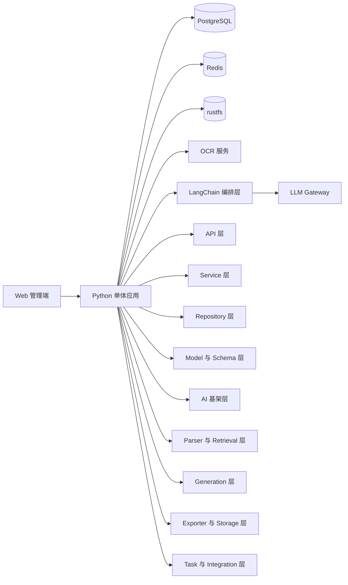
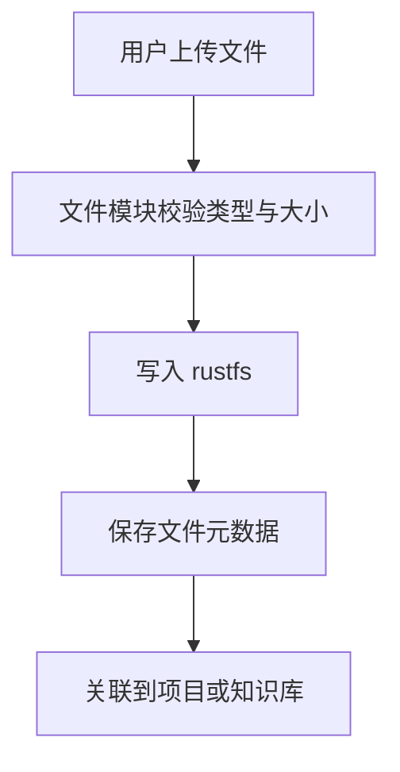
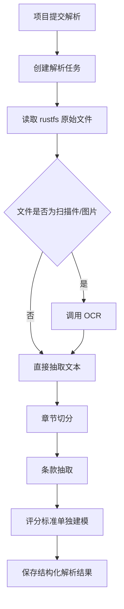
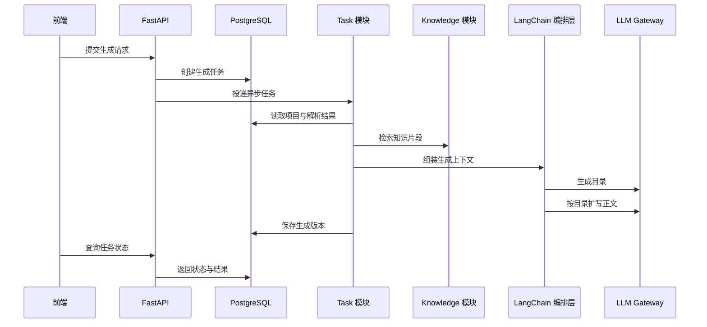

# Tender Agent 全局技术设计文档

## 1. 设计范围

本文档基于 [`docs/prd/tender-agent-prd.md`](../prd/tender-agent-prd.md) 输出 `Tender Agent` 的全局技术设计，目标范围为 `MVP` 版本。

本次技术设计聚焦以下能力：

- 招标项目创建与资料上传
- 招标文件解析与结构化抽取
- 知识库管理与检索增强生成
- 投标方案目录生成、正文扩写、编辑与导出
- 单体应用内部的模块化拆分

当前版本明确不纳入：

- 图库/图片素材管理
- 复杂多人协同、审批流、自动投标
- 完整多租户与组织隔离体系
- 复杂报价引擎与高级排版系统

## 2. 设计目标与约束

### 2.1 目标

- 快速形成一条可运行的标书生成闭环，用于验证业务价值。
- 在单体架构内完成合理的业务拆分，避免后续代码持续杂糅。
- 优先保证招标文件解析、评分标准抽取、知识库引用和文档生成主链路可用。
- 技术方案以 `Python` 生态为主，优先服务文件解析、OCR、RAG 与文档生成主链路，并引入 `LangChain` 作为 AI 编排基础设施。

### 2.2 关键约束

- 当前产品形态按“企业即用户”建模，不单独设计企业与个人用户两套主体。
- `MVP` 必须支持 `PDF`、`Word`、图片/扫描件类招标文件输入。
- 图片或扫描件必须先经过 `OCR` 再进入统一解析流程。
- 评分标准属于最高优先级解析对象，必须结构化输出。
- 知识库为可选输入，主流程不能依赖知识库才能运行。
- 文件统一存储到 `rustfs`，不再采用本地磁盘或 `MinIO` 作为当前方案。
- 当前阶段暂不启用图库能力，相关表、接口和流程均不进入 `MVP` 主设计。
- `LangChain` 仅用于模型工作流编排、检索链和 Prompt 组织，不承载核心业务状态；相关能力统一沉淀到顶层 `ai/` 基架层。

## 3. 业务建模原则

### 3.1 企业即用户

当前阶段不区分“企业”和“用户”两个业务主体，统一按“用户”建模：

- 一个登录主体代表一个企业使用单元。
- 该主体拥有自己的项目、知识库、文件与生成结果。
- 所有数据默认按 `user_id` 归属隔离。

这样设计的原因：

- 当前阶段目标是尽快打通单企业使用闭环，不引入额外的组织模型复杂度。
- 可以避免企业表、成员表、组织角色表和租户隔离策略过早膨胀。
- 后续若确实需要多成员协作，可在现有 `user` 主体之上扩展 `organization/member` 模型，而不是现在提前做重。

### 3.2 单体优先，分层清晰

系统采用单体应用形态，以清晰的全局分层骨架承接主链路能力：

- 统一部署为一个 `Python` 应用。
- 在代码结构上优先划分接口层、配置层、数据模型层、仓储层、服务层、任务层与 AI 能力层。
- 解析、检索、生成、导出、存储等能力以独立目录沉淀，便于逐步补齐实现。
- 对耗时流程使用任务化和异步化，但不急于拆成多个独立微服务。

## 4. 推荐技术栈与选型理由

### 4.1 推荐基线

- 后端框架：`FastAPI`
- AI 编排框架：`LangChain`
- 异步任务：`Celery`
- 消息中间件：`Redis`
- 关系型数据库：`PostgreSQL`
- 向量检索：`pgvector`
- 文件存储：`rustfs`
- OCR：外部 `OCR` 服务或可替换的 OCR 适配器
- 文档解析：`PyMuPDF`、`python-docx`、自定义解析组件
- 大模型接入：统一 `LLM Gateway`，由 `LangChain` 适配上层链路
- 文档导出：`python-docx`

### 4.2 选型理由

- `Python` 更适合当前 `MVP` 的核心问题：文件解析、OCR、RAG、Prompt 编排、正文生成。
- `FastAPI` 足够轻量，接口定义清晰，适合快速交付。
- `LangChain` 适合承接文档切分、检索增强、Prompt 模板、链路编排和结构化输出，能明显降低 AI 主链路的胶水代码。
- `Celery + Redis` 可以把解析、索引、生成、导出等长耗时流程从同步请求中拆出来。
- `PostgreSQL + pgvector` 能同时承载业务数据和向量检索，适合 `MVP` 控制复杂度。
- `rustfs` 作为统一文件存储，可承接原始文件、处理中间文件和导出文件，降低后续切换成本。
- 分层单体骨架更适合当前阶段：发布简单、调试成本低，也便于后续逐层补齐实现。

### 4.3 LangChain 使用边界

`LangChain` 建议只承担以下职责：

- 文档切分器封装
- Retriever 封装与检索链组装
- PromptTemplate 管理
- 结构化输出解析
- 目录生成与正文扩写链编排
- 模型调用回调与链路观测挂点

以下职责不建议交给 `LangChain`：

- 用户、项目、文件、知识库等核心业务状态管理
- 任务状态流转
- 权限控制
- 数据库存储模型定义
- 导出文件生命周期管理

### 4.4 暂不采用的方案

- 不采用微服务拆分。当前业务规模和团队阶段不值得引入分布式治理复杂度。
- 不单独拆出 AI 微服务。先在单体内通过 `ai/` 基架层完成 AI 编排与业务编排解耦。
- 不引入图库检索和图片素材编排，避免把主链路拉长。

## 5. 总体架构

系统采用“分层单体 + 异步任务 + 外部 AI/OCR/文件存储依赖”的结构。



关键原则：

- 外部只部署一个主应用，降低环境复杂度。
- 内部按全局分层骨架组织，优先稳定接口、服务、任务、AI 基架与第三方集成的依赖方向。
- 所有文件先入 `rustfs`，数据库只保存元数据和业务索引。
- 所有长耗时流程进入任务模块统一调度和状态管理。
- `LangChain` 作为 AI 能力编排层，位于服务层与底层模型/检索能力之间。

## 6. 单体内目录骨架建议

当前建议先固定顶层分层骨架，目录内实现文件后续分阶段补齐：

```text
app/
├── main.py
├── api/
│   └── v1/
├── core/
├── models/
├── schemas/
├── repositories/
├── services/
├── tasks/
├── ai/
├── parsers/
├── retrieval/
├── generation/
├── exporters/
├── storage/
├── integrations/
├── domain/
├── utils/
└── tests/
    ├── ai/
    ├── api/
    ├── services/
    ├── parsers/
    ├── retrieval/
    ├── generation/
    └── tasks/
```

目录职责说明：

### 6.1 api

负责：

- 路由注册
- 版本化接口组织
- 请求依赖注入
- 健康检查与业务接口暴露

### 6.2 core

负责：

- 配置加载
- 数据库初始化
- 日志、异常、中间件
- 安全与统一响应等基础设施能力

### 6.3 models

负责：

- ORM 模型定义
- 业务表结构映射
- 模型基础父类与公共字段

### 6.4 schemas

负责：

- 请求与响应模型
- 跨层数据传输对象
- 鉴权、项目、解析、生成、导出等结构化数据定义

### 6.5 repositories

负责：

- 数据访问封装
- 面向查询意图的持久化接口
- 对上层屏蔽 SQLAlchemy 查询细节

### 6.6 services

负责：

- 业务流程编排
- 组合仓储、解析、检索、生成、导出等能力
- 为接口层和任务层提供统一业务入口

### 6.7 tasks

负责：

- Celery 应用初始化
- 解析、知识入库、生成、导出等异步任务
- 任务重试、任务状态与失败记录

### 6.8 ai

负责：

- Chat model / embedding model 工厂
- Prompt 模板注册与加载
- LangChain chain 封装
- Retriever / RAG pipeline 组装
- 结构化输出解析
- callback、trace、token usage
- 输出校验、修复与 guardrail
- 对 `services/`、`parsers/`、`retrieval/`、`generation/` 暴露统一 AI gateway

说明：

- `ai/` 是 AI 基架层，不承担业务状态管理。
- `integrations/` 只负责第三方 client，LangChain 相关抽象统一留在 `ai/`。

### 6.9 parsers

负责：

- 文件加载与文本抽取
- `PDF`、`Word`、图片、扫描件解析
- `OCR` 适配与结构抽取
- 招标信息与评分标准提取

### 6.10 retrieval

负责：

- 文本切片
- 向量化
- 向量存储访问
- 召回、重排与知识检索流程

说明：

- 业务侧检索流程应复用 `ai/` 提供的 retriever 与 RAG 组装能力。

### 6.11 generation

负责：

- 目录生成
- 正文扩写
- 引用映射与结果校验

说明：

- 生成层负责投标场景下的生成流程编排。
- 模型创建、Prompt 注册、Chain 封装等基础能力统一由 `ai/` 提供。

### 6.12 exporters

负责：

- 文档模板渲染
- `docx` 导出
- 结果打包与交付物组装

### 6.13 storage

负责：

- 文件存储抽象
- 统一收口 `rustfs` 等存储访问逻辑

说明：

- 当前阶段虽然目录名保留存储抽象层，但默认实现仍以 `rustfs` 为准。
- 不再引入本地磁盘或 `MinIO` 作为当前主方案。

### 6.14 integrations

负责：

- `OCR`、`LLM`、Embedding、通知等外部系统调用适配
- 统一外部 SDK 与协议封装

说明：

- `integrations/` 只解决“如何连接外部系统”。
- 不在该层直接组织 LangChain chain、Prompt、Retriever 或业务生成流程。

### 6.15 domain

负责：

- 领域枚举
- 值对象
- 轻量领域规则表达

### 6.16 utils

负责：

- 时间、文本、文件、ID、哈希等稳定通用工具

说明：

- 仅保留真正通用且稳定的工具，避免演变为杂项收纳目录。

### 6.17 tests

负责：

- 按接口、AI 基架、服务、解析、检索、生成、任务等维度组织测试
- 为后续分层实现补齐单元与集成验证入口

## 7. 核心数据与存储设计

### 7.1 PostgreSQL 负责的数据

- 用户
- 用户配置
- 项目
- 项目文件关联
- 文件元数据
- 知识库
- 知识文档
- 知识切片及映射
- 招标文件解析结果
- 评分标准结构化结果
- 生成任务
- 生成结果版本
- 导出记录

### 7.2 rustfs 负责的数据

- 原始招标文件
- 原始澄清文件
- 原始清单文件
- 知识库原始文档
- 文本抽取中间文件
- OCR 中间产物
- 生成结果文件
- 最终导出文档

建议目录规划：

- `tender/raw/{userId}/{projectId}/`
- `knowledge/raw/{userId}/{knowledgeBaseId}/`
- `parse/intermediate/{projectId}/`
- `generate/result/{projectId}/{version}/`
- `export/{projectId}/{exportId}/`

### 7.3 pgvector 负责的数据

- 知识文档切片向量
- 历史标书切片向量
- 后续可扩展的条款相似检索向量

## 8. 关键处理链路

### 8.1 文件上传与入库链路



### 8.2 招标文件解析链路



说明：

- 评分标准不能只保留全文文本，必须单独结构化。
- 解析结果需要支持人工修订后再进入生成阶段。

### 8.3 知识库入库链路

- 上传知识文档
- 写入 `rustfs`
- 提取文本
- 使用 `LangChain Text Splitter` 文本切片
- 生成 embedding
- 写入向量索引
- 保存切片与原文映射关系

### 8.4 标书生成链路



### 8.5 导出链路

- 用户确认当前版本内容
- 生成 `docx`
- 写入 `rustfs`
- 记录导出元数据
- 返回下载地址或文件标识

## 9. API 与模块交互建议

### 9.1 API 分组建议

- `/api/users/*`
- `/api/projects/*`
- `/api/files/*`
- `/api/knowledge-bases/*`
- `/api/tender-analysis/*`
- `/api/generation/*`
- `/api/exports/*`
- `/api/tasks/*`

### 9.2 交互约束

- API 路由层只负责协议转换，不直接拼复杂业务流程。
- 跨模块编排应尽量收敛到应用服务层，不在多个路由入口中重复实现。
- 外部系统访问统一通过 `integration` 模块适配器，不允许业务代码直接散落调用第三方 SDK。
- `LangChain` 调用统一收口到 `ai` 模块，不允许在业务模块中随处直接创建 chain。

## 10. 数据模型建议

### 10.1 核心实体

- `user`
- `project`
- `project_file`
- `stored_file`
- `knowledge_base`
- `knowledge_document`
- `knowledge_chunk`
- `tender_analysis`
- `tender_score_item`
- `generation_task`
- `generation_result`
- `export_record`

### 10.2 关键关系

- 一个 `user` 拥有多个 `project`
- 一个 `user` 拥有多个 `knowledge_base`
- 一个 `project` 可关联多个 `project_file`
- 一个 `project` 对应一个当前有效 `tender_analysis`
- 一个 `project` 可产生多个 `generation_result`

## 11. 非功能设计

### 11.1 可维护性

- 采用分层单体结构，限制跨层反向依赖。
- 公共基础能力集中到 `core`、`domain`、`utils`，避免演变成万能杂物包。
- 长耗时流程全部任务化，减少同步接口复杂度。
- Prompt、Chain、Retriever、Parser 分层管理，避免 AI 逻辑散落在业务服务里。

### 11.2 可扩展性

- 后续可在不改动主流程的情况下补入图库模块。
- 后续可从单体中平滑拆出解析 Worker 或生成 Worker。
- 当前按 `user_id` 隔离，后续可扩展到组织维度。

### 11.3 安全性

- 文件只保存到 `rustfs`，数据库不直接存大文件内容。
- 文件访问需带权限校验和有效期控制。
- 模型调用日志与敏感文件地址应脱敏处理。

### 11.4 稳定性

- OCR、LLM、向量化等外部调用必须具备超时、重试和失败记录。
- 解析失败、生成失败、导出失败都必须可追踪、可重试。
- `LangChain` 链路必须保留可观测性挂点，便于定位 Prompt、召回和结构化输出失败原因。

## 12. 当前阶段明确不做

- 图库、图片素材管理与图片引用生成
- 企业/成员/部门/角色等复杂组织模型
- 微服务化拆分
- `PDF` 高保真排版导出
- 多人实时协同编辑

## 13. 后续演进路径

### 13.1 第一阶段

- 完成用户、项目、文件、知识库、解析、生成、导出主链路。
- 基于分层单体骨架逐步落地代码结构。
- 跑通 `rustfs` 文件读写闭环。

### 13.2 第二阶段

- 增强任务中心与可观测性。
- 丰富知识库分类、标签、召回策略。
- 引入 `LangSmith` 或等价链路观测能力，提升调试效率。
- 优化评分标准抽取与生成对齐能力。

### 13.3 第三阶段

- 视业务需要再评估是否引入图库模块。
- 视并发与团队规模再评估是否拆分独立服务。

## 14. 结论

`Tender Agent` 当前最适合采用 `Python` 分层单体架构，并以 `LangChain` 作为 AI 编排层：在部署上保持简单，在代码组织上先固定顶层骨架，再逐步补齐各层实现；业务主体按“企业即用户”统一建模；文件统一落到 `rustfs`；当前阶段暂不启用图库功能。该方案能更稳定地支撑 `MVP` 快速落地，同时为后续能力扩展保留清晰边界。
